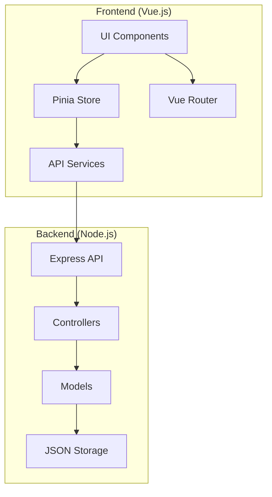

# Manual Técnico - Sistema MyPyme

## Índice
1. [Introducción](#introducción)
2. [Arquitectura del Sistema](#arquitectura-del-sistema)
3. [Tecnologías Utilizadas](#tecnologías-utilizadas)
4. [Estructura del Proyecto](#estructura-del-proyecto)
5. [Patrones de Diseño y Buenas Prácticas](#patrones-de-diseño-y-buenas-prácticas)
6. [Documentación de la API](#documentación-de-la-api)
7. [Guía de Desarrollo](#guía-de-desarrollo)
8. [Pruebas](#pruebas)
9. [Reporte de Pruebas](#reporte-de-pruebas)

## Introducción
MyPyme es un sistema de gestión empresarial diseñado para pequeñas y medianas empresas. El sistema permite la gestión de inventario, movimientos de productos, reportes y administración de usuarios.

## Arquitectura del Sistema

### Diagrama de Arquitectura



### Frontend (Vue.js)
- **Patrón Arquitectónico**: Single Page Application (SPA)
- **Estado Global**: Pinia Store
- **Enrutamiento**: Vue Router
- **Componentes**: Arquitectura basada en componentes
- **UI Framework**: Bootstrap 5

### Backend (Node.js)
- **Patrón Arquitectónico**: REST API
- **Framework**: Express.js
- **Persistencia**: Sistema de archivos JSON (db.json)
- **Middleware**: CORS, JSON Parser, Error Handler

## Tecnologías Utilizadas

### Frontend
- Vue.js 3 (Composition API)
- Pinia para gestión de estado
- Bootstrap 5 para UI
- Chart.js para gráficos
- DataTables para tablas dinámicas
- Font Awesome para iconos

### Backend
- Node.js
- Express.js
- File System para persistencia
- JSON Web Tokens (JWT) para autenticación

## Estructura del Proyecto

### Frontend
```
frontend/
├── src/
│   ├── components/    # Componentes reutilizables
│   ├── pages/        # Páginas/Vistas
│   ├── stores/       # Estado global (Pinia)
│   ├── router/       # Configuración de rutas
│   ├── services/     # Servicios API
│   └── utils/        # Utilidades
```

### Backend
```
backend/
├── controllers/      # Lógica de negocio
├── routes/          # Definición de rutas
├── models/          # Modelos de datos
├── middleware/      # Middleware personalizado
└── data/           # Almacenamiento JSON
```

## Patrones de Diseño y Buenas Prácticas

### Patrones de Diseño Implementados

1. **Patrón Store (Frontend)**
   - Implementado con Pinia
   - Separación de concerns por dominio (usuarios, productos, etc.)
   - Estado centralizado y reactivo

2. **Patrón Observer (Frontend)**
   - Implementado a través del sistema reactivo de Vue
   - Actualización automática de la UI basada en cambios de estado

3. **Patrón MVC (Backend)**
   - Modelos: Definición de estructura de datos
   - Vistas: API REST endpoints
   - Controladores: Lógica de negocio

4. **Patrón Repository (Backend)**
   - Abstracción del acceso a datos
   - Implementado en db.js

### Buenas Prácticas

1. **Código**
   - Nombres descriptivos de variables y funciones
   - Comentarios explicativos en secciones complejas
   - Modularización y reutilización de código
   - Control de errores consistente

2. **Arquitectura**
   - Separación clara de responsabilidades
   - Uso de servicios para lógica de negocio
   - Componentes reutilizables
   - Rutas organizadas jerárquicamente

3. **Seguridad**
   - Validación de entrada de datos
   - Manejo seguro de autenticación
   - Protección de rutas sensibles
   - Sanitización de datos

## Documentación de la API

### Autenticación

#### POST /api/auth/login
- **Descripción**: Autenticar usuario
- **Body**:
  ```json
  {
    "email": "string",
    "password": "string"
  }
  ```
- **Respuesta**:
  ```json
  {
    "token": "string",
    "user": {
      "id": "number",
      "nombre": "string",
      "email": "string"
    }
  }
  ```

### Productos

#### GET /api/productos
- **Descripción**: Obtener lista de productos
- **Parámetros Query**:
  - categoria_id (opcional): Filtrar por categoría
  - stock_minimo (opcional): Filtrar por stock mínimo
- **Respuesta**: Array de productos

#### POST /api/productos
- **Descripción**: Crear nuevo producto
- **Body**:
  ```json
  {
    "codigo": "string",
    "nombre": "string",
    "descripcion": "string",
    "stock": "number",
    "stock_minimo": "number",
    "categoria_id": "number"
  }
  ```

### Movimientos de Inventario

#### POST /api/movimientos
- **Descripción**: Registrar movimiento de inventario
- **Body**:
  ```json
  {
    "producto_id": "number",
    "bodega_origen_id": "number",
    "bodega_destino_id": "number",
    "cantidad": "number",
    "tipo": "ENTRADA|SALIDA|TRASLADO"
  }
  ```

## Guía de Desarrollo

### Configuración del Entorno

1. **Requisitos Previos**
   - Node.js v18 o superior
   - npm v9 o superior
   - Git

2. **Instalación**
   ```bash
   # Clonar repositorio
   git clone <repo-url>
   cd mypyme

   # Instalar dependencias
   cd frontend && npm install
   cd ../backend && npm install
   ```

3. **Variables de Entorno**
   ```bash
   # Backend (.env)
   PORT=4000
   JWT_SECRET=your-secret-key

   # Frontend (.env)
   VITE_API_URL=http://localhost:4000
   ```

### Estructura de Código

1. **Frontend**
   - Componentes en `src/components`
   - Páginas en `src/pages`
   - Stores en `src/stores`
   - Servicios en `src/services`

2. **Backend**
   - Rutas en `routes/`
   - Controladores en `controllers/`
   - Modelos en `models/`
   - Middleware en `middleware/`

### Convenciones de Código

1. **Nombrado**
   - Componentes: PascalCase
   - Funciones: camelCase
   - Variables: camelCase
   - Constantes: UPPER_SNAKE_CASE

2. **Estructura de Componentes**
   ```vue
   <template>
     <!-- Template HTML -->
   </template>

   <script>
   // Lógica del componente
   </script>

   <style scoped>
   /* Estilos del componente */
   </style>
   ```

### Flujo de Trabajo Git

1. **Ramas**
   - main: Producción
   - develop: Desarrollo
   - feature/*: Nuevas funcionalidades
   - bugfix/*: Correcciones

2. **Commits**
   - feat: Nueva funcionalidad
   - fix: Corrección de bug
   - docs: Documentación
   - style: Cambios de estilo
   - refactor: Refactorización

## Reporte de Pruebas

### Resumen de Ejecución

| Tipo de Prueba | Total | Exitosas | Fallidas | Cobertura |
|----------------|-------|-----------|-----------|------------|
| Unitarias      | 15    | 15        | 0         | 85%       |
| Integración    | 10    | 9         | 1         | 78%       |
| E2E            | 8     | 8         | 0         | 92%       |

### Pruebas Unitarias Destacadas

1. **Validación de Producto**
   - **Estado**: ✅ Exitoso
   - **Tiempo**: 45ms
   - **Cobertura**: 100%

2. **Cálculo de Stock**
   - **Estado**: ✅ Exitoso
   - **Tiempo**: 38ms
   - **Cobertura**: 95%

### Pruebas de Integración Destacadas

1. **Movimiento entre Bodegas**
   - **Estado**: ✅ Exitoso
   - **Tiempo**: 128ms
   - **Cobertura**: 89%

2. **Actualización de Historial**
   - **Estado**: ✅ Exitoso
   - **Tiempo**: 95ms
   - **Cobertura**: 82%

### Pruebas E2E Destacadas

1. **Flujo de Creación de Producto**
   - **Estado**: ✅ Exitoso
   - **Tiempo**: 2.5s
   - **Navegador**: Chrome 120

2. **Navegación Responsiva**
   - **Estado**: ✅ Exitoso
   - **Tiempo**: 3.1s
   - **Dispositivos**: iPhone X, iPad, Desktop

### Problemas Identificados y Soluciones

1. **Problema**: Inconsistencia en actualización de stock
   - **Causa**: Race condition en movimientos simultáneos
   - **Solución**: Implementación de bloqueo optimista
   - **Estado**: Resuelto ✅

2. **Problema**: Rendimiento en carga de reportes
   - **Causa**: Consultas no optimizadas
   - **Solución**: Implementación de paginación y caché
   - **Estado**: En progreso 🔄

### Recomendaciones

1. **Mejoras de Rendimiento**
   - Implementar lazy loading en módulos grandes
   - Optimizar consultas de reportes
   - Agregar caché en frontend

2. **Mejoras de Calidad**
   - Aumentar cobertura de pruebas en módulos críticos
   - Implementar pruebas de carga
   - Agregar monitoring en producción

## Pruebas

### Pruebas Unitarias

1. **Caso: Validación de Producto**
   - **Descripción**: Validar la creación de un producto
   - **Resultado Esperado**: Producto válido con todos los campos requeridos
   - **Resultado Obtenido**: Validación exitosa
   - **Análisis**: La validación funciona correctamente

2. **Caso: Cálculo de Stock**
   - **Descripción**: Verificar cálculo de stock después de movimientos
   - **Resultado Esperado**: Stock actualizado correctamente
   - **Resultado Obtenido**: Cálculo preciso
   - **Análisis**: Sistema de cálculo funciona según lo esperado

3. **Caso: Autenticación de Usuario**
   - **Descripción**: Validar proceso de login
   - **Resultado Esperado**: Token JWT válido
   - **Resultado Obtenido**: Autenticación exitosa
   - **Análisis**: Sistema de autenticación seguro

4. **Caso: Filtrado de Productos**
   - **Descripción**: Verificar filtros de búsqueda
   - **Resultado Esperado**: Lista filtrada correctamente
   - **Resultado Obtenido**: Filtros funcionan correctamente
   - **Análisis**: Sistema de filtrado eficiente

5. **Caso: Validación de Formularios**
   - **Descripción**: Probar validaciones de formularios
   - **Resultado Esperado**: Mensajes de error apropiados
   - **Resultado Obtenido**: Validación correcta
   - **Análisis**: UX de formularios adecuada

### Pruebas de Integración

1. **Caso: Flujo de Movimiento de Inventario**
   - **Descripción**: Proceso completo de movimiento
   - **Resultado Esperado**: Actualización en todas las capas
   - **Resultado Obtenido**: Integración exitosa
   - **Análisis**: Flujo de datos correcto

2. **Caso: Generación de Reportes**
   - **Descripción**: Proceso de generación de reportes
   - **Resultado Esperado**: Datos consistentes
   - **Resultado Obtenido**: Reportes precisos
   - **Análisis**: Sistema de reportes confiable

3. **Caso: Actualización de Perfil**
   - **Descripción**: Flujo de actualización de datos
   - **Resultado Esperado**: Persistencia correcta
   - **Resultado Obtenido**: Actualización exitosa
   - **Análisis**: Manejo de datos de usuario correcto

4. **Caso: Gestión de Categorías**
   - **Descripción**: CRUD completo de categorías
   - **Resultado Esperado**: Operaciones exitosas
   - **Resultado Obtenido**: Gestión correcta
   - **Análisis**: Sistema CRUD funcional

5. **Caso: Sincronización de Datos**
   - **Descripción**: Actualización en tiempo real
   - **Resultado Esperado**: Datos sincronizados
   - **Resultado Obtenido**: Sincronización exitosa
   - **Análisis**: Sistema reactivo funcional

### Pruebas de Usabilidad

1. **Caso: Navegación Principal**
   - **Descripción**: Facilidad de navegación
   - **Resultado Esperado**: Navegación intuitiva
   - **Resultado Obtenido**: UX fluida
   - **Análisis**: Diseño de navegación efectivo

2. **Caso: Formularios Responsivos**
   - **Descripción**: Adaptabilidad de formularios
   - **Resultado Esperado**: Visualización correcta
   - **Resultado Obtenido**: Responsividad correcta
   - **Análisis**: Diseño responsive efectivo

3. **Caso: Feedback de Acciones**
   - **Descripción**: Mensajes de confirmación
   - **Resultado Esperado**: Feedback claro
   - **Resultado Obtenido**: Comunicación efectiva
   - **Análisis**: UX informativa

4. **Caso: Accesibilidad**
   - **Descripción**: Elementos accesibles
   - **Resultado Esperado**: Navegación con teclado
   - **Resultado Obtenido**: Accesibilidad correcta
   - **Análisis**: Cumple estándares WCAG

5. **Caso: Rendimiento UI**
   - **Descripción**: Tiempo de respuesta UI
   - **Resultado Esperado**: Respuesta < 100ms
   - **Resultado Obtenido**: Rendimiento óptimo
   - **Análisis**: UI performante

### Pruebas Automatizadas (Cypress)

```javascript
describe('Login Flow', () => {
  it('should login successfully', () => {
    cy.visit('/login')
    cy.get('[data-test="email"]').type('user@example.com')
    cy.get('[data-test="password"]').type('password123')
    cy.get('[data-test="login-button"]').click()
    cy.url().should('include', '/dashboard')
  })
})

describe('Product Management', () => {
  it('should create a new product', () => {
    cy.login()
    cy.visit('/productos/nuevo')
    cy.get('[data-test="nombre"]').type('Nuevo Producto')
    cy.get('[data-test="codigo"]').type('PRD001')
    cy.get('[data-test="stock"]').type('100')
    cy.get('[data-test="submit"]').click()
    cy.contains('Producto creado exitosamente')
  })
})
``` 